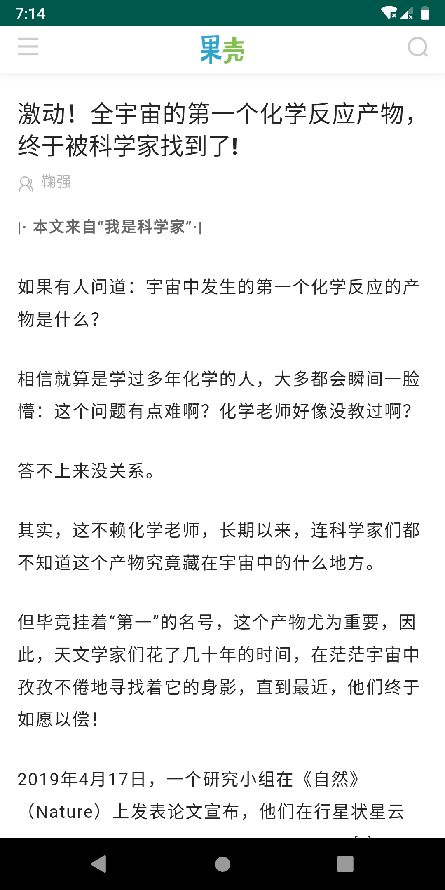

# YunBianNews
--------------
一款可以查看新闻和科普文章的App,基于Android Architecture Components, 正在进一步开发中...
    
    新闻数据来源: 新华网RSS
    科普文章来源: 果壳网
--------------
## 新闻
用sax解析返回的xml数据，并保存到数据库

## 果壳
用OkHttp+Gson解析，并保存到数据库

软件截图: 

    
    
    
    
     
    
    

正在添加更多的数据和功能...
